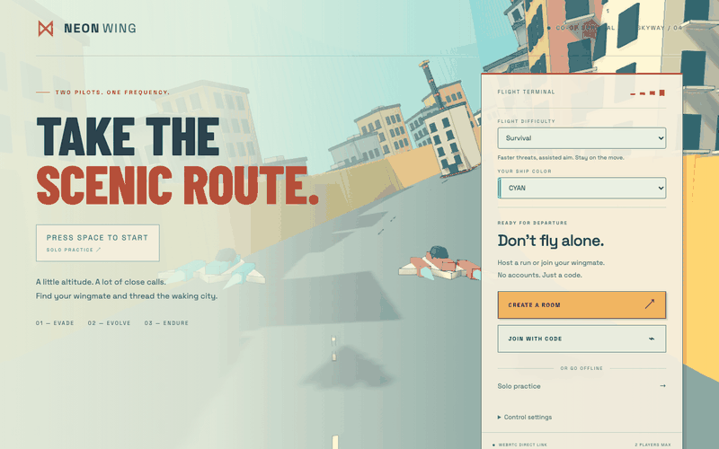

# NEON WING

A two-player illustrated city flight survival game built with **SvelteKit + pure Three.js + PeerJS**. Follow a banking chase camera along an elevated skyway with hairpins, climbs and descending bends, dodge poles and overhead gates, evade orange asteroids, and collect upgrades while your weapons automatically target the nearest threat.

The illustrated direction reinterprets the outlined architecture and street-level composition of [Messenger by Abeto](https://messenger.abeto.co). All geometry is original and generated in JavaScript; no Blender, downloaded models, or copied reference assets. The licensed soundtrack is credited below.

## Live preview

[](https://spaceship-multiplayer.vercel.app)

<p align="center"><a href="https://spaceship-multiplayer.vercel.app"><strong>▶ Play Neon Wing live</strong></a></p>

The preview is captured from the deployed home page, including the ships moving through the background. [Open the static screenshot fallback](docs/screenshots/neon-wing-home.png) if your Markdown viewer does not animate GIFs.

## Run locally

Use Node **22.12+** (Node 22 LTS recommended) and npm.

```sh
npm install
npm run dev
```

Open **http://localhost:5173**. Press **Space** in the terminal, tap the pulsing **Tap to start** prompt on a phone, or choose **Solo practice** for an offline run, or **Create a room** and share the four-character code with a second browser/device. The second player chooses **Join with code**. The run starts automatically when the second pilot connects. No accounts or server setup are required for normal play; multiplayer uses the public PeerJS signaling service and requires internet access.

For two devices on the same Wi-Fi, open the Network URL printed by Vite on the second device. For routine co-op testing, use two windows side by side: hiding a game tab or changing window focus requests a synchronized pause, so both pilots may need to resume. Chromium, Firefox, and Safari with WebGL2 and WebRTC enabled are the intended targets; only Chromium is automated here.

## Controls and gameplay

| Action | Control |
| --- | --- |
| Start solo | Space in the main terminal or tap the pulsing prompt |
| Steer | WASD or arrow keys; A/D bank into turns |
| Boost | Hold Shift; release to coast back to cruise |
| Climb | Hold Space; release for a smooth descent |
| Shoot | Automatic; assisted in Scenic/Survival, straight ahead in Brutal |
| Pause / resume | Escape or the pause button |
| Touch movement | Drag pad, or optional calibrated tilt in Control settings |
| Touch boost | Pull beyond the drag pad’s outer ring; release to coast |
| Touch climb | Hold the CLIMB button while steering |
| Upgrade | Fly near cores to attract and collect them |

- Cyan cores increase fire rate (eight levels); magenta cores add spread (up to five projectiles).
- Select Scenic, Survival, or Brutal before launch. The host sets the shared difficulty; each pilot independently chooses cyan, coral, gold, violet, or mint. Brutal has faster spawns, double damage, and no assisted aim: align horizontally and vertically.
- Each pilot cruises at approximately 140 km/h and can pull beyond the drag-pad ring for a substantially faster boost (up to approximately 260 km/h); release the outer drag to coast back to cruise. Desktop pilots hold Shift for the same boost. Altitude ranges from 4 to 32 metres above the street. Hold climb to clear rooftops; release to descend. Enemies, shots, drops, and building collisions all account for altitude.
- The route rises above the city, banks through hairpins and doubles back in world space. Steering and altitude are relative to its banked surface. Curves push the ship outward, especially under boost: countersteer to stay inside the guard fields. Boundary crashes damage hull and reduce boost. Solid towers, striped poles and overhead gates share their rendered geometry with host collision volumes; gates require flying above or below. Collisions push the ship clear and slow it down. Scenic/Survival hits cost one hull point; Brutal hits cost two. The floor retains a hover assist.
- Both ships have five hull points. Hits briefly grant invulnerability.
- One downed pilot can spectate while the other survives; the run ends when both are down. Choose Play Again on the end screen to restart the same solo/co-op session when the wingmate is still connected, or return to the terminal to reconnect.
- Enemy arrival rate increases continuously; speed increases each 25-second sector. Spawns and projectile lifetimes are capped to bound resource use.
- Either player can pause. Each pilot clears their own pause flag; both must be clear before the shared run resumes. Backgrounding a tab also pauses it.

## Verify

```sh
npm run check
npm test
npm run build
npm run preview
```

Automated browser tests exercise actual WebGL rendering, solo pause/resume, mobile layout, two real PeerJS peers, pause ownership and disconnect handling:

```sh
npx playwright install chromium
npm run test:e2e
```

The test runner starts a **development-only** local PeerJS signaling server on port 9000 and Vite on port 5173. Keep those ports free, or select another Vite port with `E2E_PORT=5174 npm run test:e2e`. This server is never used by the deployed app. Headless tests use software WebGL; browser downloads require internet, but the tests do not rely on PeerJS cloud. Screenshots are written to `test-results/` (git-ignored).

## Deploy to Vercel

```sh
npm install
npm run check
npm test
npm run build
npx vercel login
npx vercel
# After checking the preview deployment:
npx vercel --prod
```

Select the **SvelteKit** framework if prompted. Build command: `npm run build`. Leave the output-directory override unset; `@sveltejs/adapter-vercel` generates `.vercel/output`. The adapter explicitly targets `nodejs22.x`; select Node 22 in Vercel project settings. HTTPS is provided by Vercel. No database or application socket server is required. Set private `METERED_DOMAIN` and `METERED_API_KEY` in Vercel to enable the configured relay in deployments; the git-ignored local `.env` is not uploaded by git. Use the same domain and key as your local `.env`, then redeploy.

Production is connected to the GitHub repository: pushing `main` triggers Vercel automatically. The CLI commands above are available for manual preview or production deployments. Deployment credentials are not stored in this repository.

## How synchronization works

```text
Vercel ── serves Svelte UI + Three.js + PeerJS to both browsers
PeerJS signaling service ── introduces host and guest
Host browser ←──── direct WebRTC data channel ────→ Guest browser
  60 Hz authoritative simulation                    30 Hz movement input
  20 Hz snapshots ────────────────────────────────→ predicted guest movement
```

The four-character uppercase alphanumeric room code **is the host's Peer ID**. Code collisions retry up to eight times. A host accepts one guest with the matching protocol version (`neon-wing-city-v7`, incompatible with earlier builds) and rejects additional connections. Four characters are intended for casual invitations, not private authenticated sessions.

`Simulation` owns movement limits, spawns, auto-fire, collision detection, damage, drops, upgrades, score and run completion. Guests send only normalized movement intent and their pause state. Input is validated for finite coordinates and normalized by the host; stale input expires after 300 ms. Guests never submit health changes, hits, or enemies. The guest predicts its own movement using the same pure movement function and replays recent input frames over incoming authoritative positions. Prediction is capped at 200 ms without snapshots; hull changes immediately correct it. The local pilot remains immediately predicted while the remote pilot uses a short authoritative interpolation buffer to absorb snapshot jitter. The host still owns all combat, collisions and health. There is no host migration. An interrupted transport can be rebuilt for the same original peer within a bounded recovery window; reloading a tab creates a new session and requires a new run.

Pause, launch, replay and final state use PeerJS’s chunked reliable binary channel. Routine input and snapshots use a separate unordered WebRTC channel with no retransmissions when available, so obsolete state can expire in transit. The reliable channel remains the fallback. Sequence numbers reject reordered updates, and run IDs prevent packets from a previous replay affecting a new run. Above 16 KB of buffered channel data, updates coalesce to the latest state. Remote presentation advances on a smoothly adjusted clock with a 100 ms buffer and up to 200 ms of extrapolation; guest reconciliation also compensates for changes in the route clock.

Heartbeat timers continue during pause. A transient ICE disconnect gets 20 seconds to recover, and a closed/failed route begins a bounded 45-second reconnection window. The game holds during rebuilding, retains pause ownership, and accepts only the original peer. Connection failure after the grace window ends the session. These bounds cannot make an offline peer or a firewall that blocks WebRTC reachable.

## Signaling and restrictive networks

Vercel does **not** host a persistent WebSocket server for this game. PeerJS uses an external signaling broker to introduce browsers; game state travels over WebRTC. Public signaling is a third-party availability dependency. Some corporate networks, mobile carriers, and symmetric NATs require a TURN relay.

Copy `.env.example` to `.env` if you want a custom signaling service or TURN relay:

| Variable | Purpose |
| --- | --- |
| `PUBLIC_PEER_HOST` | Optional signaling hostname; blank uses PeerJS cloud |
| `PUBLIC_PEER_PORT` | Custom signaling port, default `443` |
| `PUBLIC_PEER_PATH` | Custom signaling path, default `/` |
| `PUBLIC_PEER_SECURE` | `true` in production; `false` only for local HTTP tests |
| `METERED_DOMAIN` | Server-only Metered domain: `spaceship-multiplayer.metered.live` |
| `METERED_API_KEY` | Server-only credential API key; keep in ignored `.env` locally and private Vercel environment settings |
| `PUBLIC_TURN_URL` | Relay URL, e.g. `turns:relay.example.com:5349` |
| `PUBLIC_TURN_USERNAME` | TURN username |
| `PUBLIC_TURN_CREDENTIAL` | TURN credential |

The supplied Metered account is configured in the local ignored `.env`. `/api/ice` fetches its ICE server list on the server, caches it for one minute and sends only connection credentials to browsers. The API key stays server-side and is not committed. Metered takes priority over coturn. Upstream failures return a clear unavailable response; clients can still try direct ICE. Production relay configuration and relay-only data transfer were verified on September 17; that historical check does not establish compatibility with every VPN or corporate firewall.

All `PUBLIC_*` values are visible to browsers. Use short-lived TURN credentials for a production service; do not embed a long-lived private secret. For coturn REST authentication, configure server-only `TURN_URLS` (comma-separated relay URLs) and `TURN_SECRET` (matching coturn’s `static-auth-secret`). `/api/ice` issues 10-minute HMAC credentials without exposing the shared secret. Set these as private Vercel environment variables. The endpoint does not provision a TURN server. Existing `PUBLIC_TURN_*` credentials remain supported for other providers. Put custom values in Vercel project environment settings and redeploy. Failure to connect is shown in the terminal with a retry path. Losing the host ends the run.

Connection attempts retry up to three times before launch; the third forces relay-only routing when credentials are available. Recovery attempts prefer relay from the second attempt. Both sides time out abandoned handshakes. Guest joining has an overall 85-second deadline after opening signaling; an open data channel must synchronize launch within ten seconds. Configure UDP, TCP and TLS relay URLs from your provider, including a TLS route on port 443 where supported. The server preserves configured TCP/TLS URLs without inventing relay hosts. See [Metered’s transport documentation](https://www.metered.ca/docs/turn-server-service/overview/). Actual corporate VPN/firewall compatibility requires testing on that network.

On September 17, the production `/api/ice` returned an empty server list while the local Metered credentials successfully returned five ICE servers, including TURN. This was resolved by configuring the existing private `METERED_DOMAIN` and `METERED_API_KEY` in Vercel's Production environment and redeploying. Live `/api/ice` now returns `provider: "metered"` and five servers. Chromium verification confirmed an echoed payload through two relay candidates; a live two-player test forced relay-only connections and verified launch, guest state reception, and guest-initiated pause reaching the host. Separate physical devices/carrier networks remain untested. For future deployments, configure these private variables and verify TURN data transfer; never publish the API key.

Tilt steering requires a secure context (HTTPS), device support, and permission where the browser asks. Drag steering remains available if permission or sensors are unavailable. The tilt neutral position recalibrates after screen rotation; the CALIBRATE button resets it manually. Sensitivity is adjustable from the terminal or pause menu.

## Repository map

```text
src/
  app.html                     HTML document shell
  app.css                      Illustrated terminal and compact responsive HUD
  routes/
    +layout.svelte             Global styles
    +page.svelte               Menu, join, lobby, HUD, touch and synced pause UI
  lib/
    net/PeerSession.js         PeerJS lifecycle, room IDs and protocol
    game/
      settings.js              Validated difficulty and ship colors
      TiltInput.js             Permission-aware mobile tilt and calibration
      course.js                Shared deterministic route and tower geometry
      simulation.js            Pure host-authoritative fixed-step game rules
      procedural.js            Batched outlined architecture, ships, rocks, cores
      scene.js                 Chase camera, daylight, curved road and subtle bloom
      Engine.js                Game loop, input, snapshots and visual interpolation
tests/
  simulation.test.js           Deterministic game-rule tests
  browser/game.spec.js         Chromium and two-peer integration tests
scripts/test-signaling.js      Test-only local signaling broker
playwright.config.js          Browser runner and isolated test services
svelte.config.js              Vercel adapter, explicit Node 22 runtime
agents.md                     Objective, progress and next-session handoff
```

All meshes are generated in code. City blocks batch static geometry by material and share dark contour lines. Toon materials, warm plaster, teal glazing, trees, street lamps, overhead infrastructure and soft shadow maps from the actual geometry establish the illustrated style. A sampled periodic route provides a shared 3D position, tangent, bank and elevation frame. Road ribbons, guard fields, scenery, hazards, ships and chase camera use that frame; deterministic obstacle layouts and collision boxes come from `course.js`. Simulation coordinates remain relative to the route, so shots follow the corridor rather than inertial world-space ballistic trajectories. Each pilot's camera follows their own ship, keeping it near the center without pulling away in portrait mode. This is a guided roller-coaster-style skyway with lateral/forward dodging and altitude control; it is not a free-roaming six-axis flight simulator or a vertical-loop track.

The composer uses FXAA edge smoothing and restrained bloom limited to bright effects. No dark overlay covers active gameplay. No models or texture assets need downloading. Optional Google Fonts enhance the terminal typography; system fallbacks remain usable offline.

The Three.js engine is dynamically imported on mount so server rendering never touches browser APIs. The engine chunk is approximately 561 kB minified (144 kB gzip); Vite may emit its standard 500 kB chunk advisory. Pixel ratio is capped at 1.5 to limit bloom cost. Full cross-device GPU performance and public-internet NAT traversal still need validation on the target devices.

Previous city-edition verification: Svelte checks, ten simulation tests, four Chromium integration tests and the Vercel build passed. For the mechanics update, sixteen simulation tests and a build completed before the user requested no further testing. Final networking/UI adjustments have not been rerun through checks; no browser/device testing was performed for this update. Dependency audit reports three low advisories through SvelteKit/cookie and three moderate advisories through the test-only PeerServer/Express/qs chain; normal `npm audit fix` did not clear these. See `agents.md` for the exact verification record and follow-up scope.

References: [PeerJS connection API](https://peerjs.com/client/api/peer), [SvelteKit on Vercel](https://vercel.com/docs/frameworks/full-stack/sveltekit).

## Previous city edition screenshots

[Desktop flight](docs/screenshots/city-desktop.png) · [Phone portrait](docs/screenshots/city-mobile.png) · [Landscape](docs/screenshots/city-landscape.png)

## Skyway update — September 6, 2026

Merged `feat/illustrated-city-flight` into `main`; continued all work on `main`. Added the quick solo prompt, Metered integration, binary network transport and stale-message handling, guest movement prediction, connection animations, and banked elevated route with boundary/pole/gate crashes. Per request, **no tests, Svelte checks, builds, browser runs or live credential calls were run for this update**. Existing test expectations and screenshots describe earlier course geometry and have not been updated or validated. Deployment and real-device connection quality remain unverified.

### Repair validation — September 19, 2026

Compacted the pilot HUD; restored an independent touch boost button alongside outer-ring drag boost, with a steering dead zone, radial clamping, pointer ownership and boost hysteresis. Host presentation interpolates fixed simulation steps; guest prediction uses the same step size, and remote interpolation advances between packets in the correct route frame. Removed per-packet telemetry UI updates and redundant WebGL multisampling (FXAA remains). Backpressure includes PeerJS's internal queue; browser suspension and temporary ICE interruptions receive a recovery window.

Validation: Svelte check has zero errors/warnings, all 26 unit tests pass, the production build succeeds, and the mobile Chromium test passes with compact-card bounds and drag boost checks. The mobile screenshot was inspected. A two-peer Chromium run completed joining, snapshots and both pilots' pause/resume checks, but its departure assertion used the old timeout. Subsequent full attempts timed out and reported browser-context disposal errors; a complete passing multiplayer browser run and actual cross-network/device stability are **not verified** by this repair. Both pilots must reload for protocol v6.

Touch-control follow-up: removed the separate boost button; outer-ring drag boost remains. The steering pad now sits farther right (64–100 px responsive left inset) to leave room for leftward finger travel.

## Music credits

**“in search of something more” — Elektrobear, _80 Songs Pack_.** Used from the purchased royalty-free music pack supplied by the project owner.

The track loops during flight at a restrained default volume. Use the music button in the terminal header or pause card to mute/unmute; the preference is saved on the device. Music pauses with either pilot’s pause, on game over, and when the page is hidden. Returning to the terminal resets playback. The original Ogg and an AAC compatibility copy are served locally; playback starts after a user gesture.

## September 22–23 city and stability update

The route now runs through original old-town, market, terrace, highline, canal and garden details: windows, shop signs, awnings, balconies, vending machines, air conditioning, rooftop tanks, cables and greenery. Lower curbs expose the streets while banked turns and crests retain the ride. Solid route obstacles leave readable gaps; decorative large structures stay outside the flight lane. Static districts merge into one vertex-colored mesh plus outlines per block to limit draw calls.

Scenic repairs one hull point after 14 damage-free seconds; Survival after 24. Brutal has no automatic repair. Neither repair revives a downed pilot.

Both pilots must reload for protocol `neon-wing-city-v7`. Historical validation sections above refer to earlier versions; see the latest entry in `agents.md` for this update’s verification and limitations.

### Dense city and endless solo — September 23, 2026

Solo practice has unlimited hull in every difficulty (♥ ∞); collisions still deflect and slow the ship. Co-op retains five hearts and normal damage. The city now surrounds banked turns and high flight with a 31×31 pool of pastel buildings, varied heights, roof caps and facade bands in three instanced draw calls. Background buildings leave clearance around the flight route. Nearby districts have a broader plaster palette and detailed end facades; placement updates at block boundaries instead of every frame.

Road towers carry original canvas-generated space travel posters on both approach faces, cycling through 24 sayings: short Cowboy Bebop, Star Trek and Star Wars references alongside original flight/travel lines. No external image assets are used.

Focused validation: three collision/unlimited-hull tests, Svelte check, production build, and a Chromium render smoke check covering poster approaches and high banked flight. Physical-device performance has not been benchmarked.
